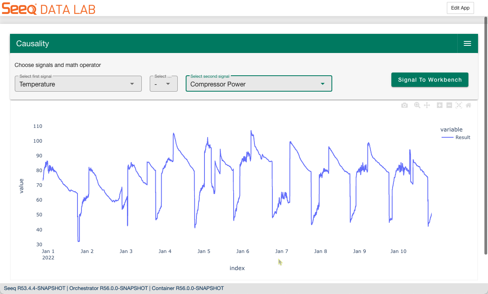

User guide goes here... If you need figures or videos used the provided html links

# User Guide

blah, blah

## If you need to insert a figure...

Insert this on your markdown file. Make sure to update the `src`

```html
<br>
<table border="0">
 <tr>
    <td></td>
 </tr>
 <tr>
    <td>Figure 1. Example of figure for documentation.</td>
 </tr>
</table>
<br><br>
```

The above will display like this on your documentation: 
<br>
<table border="0">
 <tr>
    <td></td>
 </tr>
 <tr>
    <td>Figure 1. Example of figure for documentation.</td>
 </tr>
</table>
<br><br>


## If you need to insert a video...
Insert this on your markdown file. Make sure to update the `src`, title in `span`, the poster, etc. 


```html
<details open="" class="details-reset border rounded-2">
  <summary class="px-3 py-2 border-bottom">
    <svg aria-hidden="true" height="16" viewBox="0 0 16 16" version="1.1" width="16" data-view-component="true" class="octicon octicon-device-camera-video">
    <path fill-rule="evenodd" d="M16 3.75a.75.75 0 00-1.136-.643L11 5.425V4.75A1.75 1.75 0 009.25 3h-7.5A1.75 1.75 0 000 4.75v6.5C0 12.216.784 13 1.75 13h7.5A1.75 1.75 0 0011 11.25v-.675l3.864 2.318A.75.75 0 0016 12.25v-8.5zm-5 5.075l3.5 2.1v-5.85l-3.5 2.1v1.65zM9.5 6.75v-2a.25.25 0 00-.25-.25h-7.5a.25.25 0 00-.25.25v6.5c0 .138.112.25.25.25h7.5a.25.25 0 00.25-.25v-4.5z"></path>
    </svg>
    <span aria-label="Video description _static/example_video.mp4" class="m-1">Example Video for Documentation</span>
    <span class="dropdown-caret"></span>
  </summary>

<video src="_static/example_video.mp4"
poster="_static/addon_example.png"
controls="controls" muted="muted" class="d-block rounded-bottom-2 width-fit" style="max-width:700px; background:
transparent url('_static/overview.png') no-repeat 0 0; -webkit-background-size:cover; -moz-background-size:cover;
-o-background-size:cover; background-size:cover;"
webboost_found_paused="true" webboost_processed="true">
</video>
</details>

```

The above will display like this on your documentation: 
<details open="" class="details-reset border rounded-2">
  <summary class="px-3 py-2 border-bottom">
    <svg aria-hidden="true" height="16" viewBox="0 0 16 16" version="1.1" width="16" data-view-component="true" class="octicon octicon-device-camera-video">
    <path fill-rule="evenodd" d="M16 3.75a.75.75 0 00-1.136-.643L11 5.425V4.75A1.75 1.75 0 009.25 3h-7.5A1.75 1.75 0 000 4.75v6.5C0 12.216.784 13 1.75 13h7.5A1.75 1.75 0 0011 11.25v-.675l3.864 2.318A.75.75 0 0016 12.25v-8.5zm-5 5.075l3.5 2.1v-5.85l-3.5 2.1v1.65zM9.5 6.75v-2a.25.25 0 00-.25-.25h-7.5a.25.25 0 00-.25.25v6.5c0 .138.112.25.25.25h7.5a.25.25 0 00.25-.25v-4.5z"></path>
    </svg>
    <span aria-label="Video description _static/example_video.mp4" class="m-1">Example Video for Documentation</span>
    <span class="dropdown-caret"></span>
  </summary>

<video src="_static/example_video.mp4"
poster="_static/addon_example.png"
controls="controls" muted="muted" class="d-block rounded-bottom-2 width-fit" style="max-width:700px; background:
transparent url('_static/overview.png') no-repeat 0 0; -webkit-background-size:cover; -moz-background-size:cover;
-o-background-size:cover; background-size:cover;"
webboost_found_paused="true" webboost_processed="true">
</video>
</details>